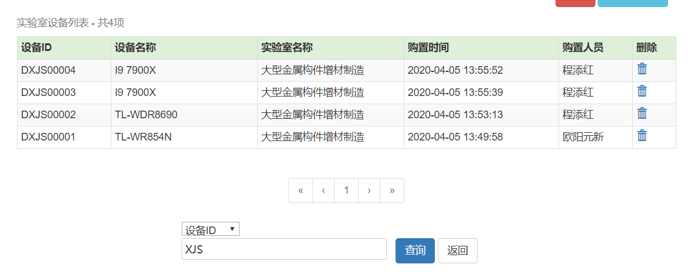

## 实验室设备管理系统

### 需求

+++


### 页面效果

+++

#### 登陆界面

> 密码错误和用户不存在会有相应的弹窗提示


#### 注册界面

> 用户通过内置的邀请码（123456）进行注册
>
> 确认密码不一致/邀请码错误/输入项为空会有相应的弹窗提示


#### 设备展示

> 设备ID由（实验室名+该设备在实验室内编号）确定；购置时间由系统自动生成
>
> 采用sessionStorage进行管理员信息的传递，右上方登出可返回到登陆界面
>
> 每条记录对应删除按钮


#### 添加设备

> 输入为空会进行相应的弹窗提示


#### 查询设备

> 可用关键字进行模糊查询





### 展示后修改与优化说明

+ 设备ID重新分配，采用`实验室名+设备在实验室内编号` 生成设备ID

+ 将添加设备独立为新页面

+ 新增功能：

  + 细化登录提示：密码错误/用户不存在

  + 管理员注册
  + session传递管理员信息
  + 管理员登出
  + 删除设备记录
  + 根据关键字进行模糊查询，并在当前页面显示查询结果
  + 新增大量友好提示

### 部署说明

+++

+ 开发环境：`IDEA + JDK1.8`
+ 开发框架：`maven_3.5.4 + SSM`
+ 数据库：`mysql_8.0.19`
+ web服务器：`Tomcat_8.5.51`

部署流程

1. 本地下载并配置`maven`，`mysql`, `Tomcat`，设置相应环境变量

2. `mysql`中新建本地数据库`LEM`，并新建两张表`user`和`equipment`，对应管理员和实验室设备

   ```mysql
   # 新建数据库
   create database LEM default character set utf8;
   use lem;
   
   # 管理员
   create table user(
   	id int(10) NOT NULL AUTO_INCREMENT,
       username varchar(100) binary NOT NULL, # binary:用户名和密码强制区分大小写
       password varchar(100) binary NOT NULL, # 该字段为MD5加密字段
       primary key(id)
   ) ENGINE=InnoDB DEFAULT CHAR SET=utf8;
   
   # 实验室设备
   create table equipment(
   	id int(10) NOT NULL AUTO_INCREMENT,
       e_id varchar(100) binary NOT NULL, # binary:设备ID强制区分大小写
       e_name varchar(100) NOT NULL, # 设备名
       l_name varchar(100) NOT NULL, # 实验室名
       p_name varchar(100) NOT NULL, # 采购人
       create_time datetime DEFAULT NULL,
       primary key(id)
   ) ENGINE=InnoDB DEFAULT CHAR SET=utf8;
   ```
   
3. 运行`IDEA`

   + 导入项目，修改`src\main\resource\jdbc.properties`为本地数据库用户和密码

     ```properties
     jdbc.driver=com.mysql.cj.jdbc.Driver
     jdbc.url=jdbc:mysql://localhost:3306/lem?useUnicode=true&characterEncoding=utf8&serverTimezone=GMT%2B8
     jdbc.username=xxx
     jdbc.password=xxx
     ```

   + Tomcat配置：在`project structure`中添加`artifacts`，`web app exploded` : `LEM:war exploded`（开发版），然后在右上角的运行窗口：`Edit Configurations`配置Tomcat（如下图）

     

     

4. 运行Tomcat，注册管理员用户（邀请码`123456`），登陆成功后进行管理

### UML

+++

#### 活动图


> 进入系统进行**管理员登陆**或者**管理员注册**，注册成功后返回到**管理员登陆**
>
> 系统对用户的输入进行合法性验证以及用户认证
>
> 登陆成功进行**设备展示**，下一阶段可选的活动有：**登出**，**添加设备**，**删除设备**，**查找设备**
>
> **登出**应返回到**管理员登陆**，其他均返回到**设备展示**

#### 用例图


> 系统唯一的交互人员是管理员
>
> 管理员与系统进行交互：登陆登出、设备的增删查

#### 状态图


> 模型对应有登陆、登出、注册、检查、展示设备、添加设备、删除设备、查找设备共八种状态
>
> 打开系统可进行登陆和注册操作，经过后台认证后，登陆系统展示设备列表，然后进行到设备的增删查和管理员登出四种状态

#### 类图


`Equipment`和`User`是存在于整个系统运行周期的两个**实体类**，分别对应实验室设备和管理员。其中实验室设备拥有该设备的五条基本信息：设备ID，设备名，实验室名，购置人名，采购时间；管理员拥有`username`和`password`两个基本字段信息。

`Dao` 层的`EquipmentDao`和`UserDao`是`Mybatis`后端与**数据库**连通的接口，与`resource/mapper`下的`*.xml`文件对应，将数据库语句封装为具有实际意义的**具体操作**。

其中`EquipmentDao`封装了三个操作

+ `getTotal`得到实验室设备的数目，其中`type`和`val`对应查询所需的关联字段和关键字
+ 添加设备时将一个实体类`Equipment`添加进本地数据库，删除设备时只需获取设备ID即可
+ `findMaxId`用于找到已分配给该实验室的最大ID，用于添加新设备时生成设备ID
+ `list`展示从`start`开始的`count`个设备信息，用于分页展示，`type`和`val`同`getTotal`

`UserDao`封装两个操作

+ 在本地数据库中根据`username`查询用户，并返回`User`实体，用于登陆时进行管理员认证
+ 管理员注册时，将`service`发来的`username`和MD5加密后的`password`添加进数据库

`EquipmentService`和`UserService`属于B/S三层架构中的**用户服务层**，实现相应的业务逻辑

+ 调用`ChineseUtil`和`Allocate`两个工具类为新增的设备分配设备ID，其中`ChineseUtil`是对中文的拼音首字母进行提取，`Allocate`根据该实验室最大的设备ID分配下一台设备的ID

`EquipmentController`和`UserController`是系统前后端连接的控制器，是MVC模式的模型，视图控制器，对前端的表单提交数据进行加工发送到`service`端，返回模型信息给前端页面进行展示，并管理页面的跳转

+ `EquipmentController`使用到的`Page`类是实验室设备进行分页展示的工具类
+ `UserController`使用到的`MD5`类是对用户在前端输入的密码字段进行MD5加密的工具类

类图中关联关系均为1对1的聚合关系，每一层之间相同独立，上层使用低层提供的服务

#### 顺序图

以登陆+添加设备为例


用户在`login.jsp`界面输入用户名和密码后，`UserDao`根据`username`在数据库中进行查询返回相应的管理员对象，在MD5加密后的密码字段进行比较后返回认证成功或者认证失败信息。

用户在进入`listEquipment.jsp`界面后即可查看实验室设备列表，查看实验室设备列表拥有最长的生命周期。

进行`addEquipment`时，添加成功后会刷新返回到实验室设备列表展示页面，显示刚才添加成功的设备，此过程同样涉及到新设备的设备ID分配、数据库操作、前端展示等过程。

