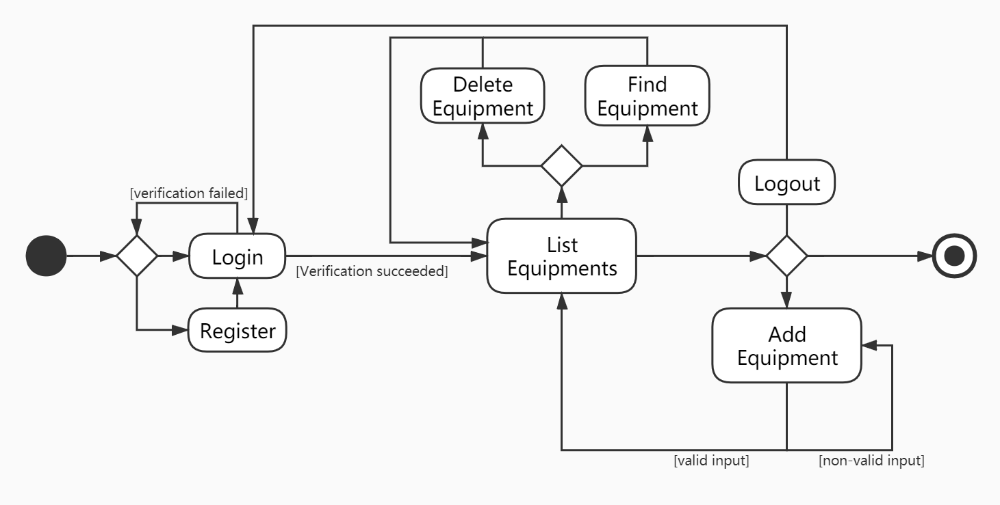

### 需求分析


### 部署

+++


### UML

+++

#### 活动图



#### 类图


### 数据库设计

```mysql
# 登陆数据库
mysql -u root -p
# 查看数据库列表
show database;
# 创建
create database equipment default character set utf8;
# 选择数据库
use equipment;
# 查看table
show tables;
# 删除数据库
drop database equipment;

create database LEM default character set utf8;
use lem;


# 实验室设备
create table equipment(
	id int(10) NOT NULL AUTO_INCREMENT, # 设备ID是自增变量，保证设备ID唯一
    e_name varchar(10) NOT NULL,
    l_name varchar(10) NOT NULL,
    p_name varchar(10) NOT NULL,
    create_time datetime DEFAULT NULL,
    primary key(id)  # 设备ID作为主键
) ENGINE=InnoDB DEFAULT CHAR SET=utf8;


# 查看表结构
desc equipment;
# 查看表内容
SELECT * FROM equipment;
# 删除一列
ALTER TABLE equipment drop column create_time;
# 新增一列
ALTER TABLE equipment add column create_time varchar(30) NOT NULL;


# 管理员
create table user(
	id int(10) NOT NULL AUTO_INCREMENT,
    username varchar(10) NOT NULL,
    password varchar(100) NOT NULL,
    primary key(id)
) ENGINE=InnoDB DEFAULT CHAR SET=utf8;

# 用户名：red 密码：123456
insert into user values(NULL, 'red','4QrcOUm6Wau+VuBX8g+IPg==');

delete from equipment;
ALTER TABLE equipment AUTO_INCREMENT = 1;
```


```
选题：实验室设备管理系统
语言：Java, JDK1.8
IDE：IDEA
框架：maven+SSM
数据库：mysql
web服务器：tomcat

下面是开发系统的部署说明：
首先在本地配置maven，mysql和tomcat环境，设置相应的环境变量
maven：3.5.4
mysql：8.0.19
tomcat：8.5.51
在mysql中新建LEM数据库，并新建两张表：user和equipment，分别对应管理员和实验室设备
需要说明的是在equipment表中：设备ID是自增变量，保证设备ID唯一性
在user表中password字段采用MD5加密

接下来是项目的运行：
将项目导入IDEA后，需修改resource下的jdbc文件
其他的均按照pom配置导入包即可，spring的配置文件和Dao层配置文件无需修改
接下来是tomcat的配置，首先进入project structure添加artifacts
然后配置Tomcat

功能点介绍：
index.jsp用首先跳转到login界面
输入错误
输入正确
进入设备列表界面，左上方会显示设备数量
依次展示所有设备信息：
设备ID采用自增主键
购置时间是采用系统时间，为增加设备的时间
一个页面展示10个条目，可通过下方的页面索引进行跳转
观察到我们这里保障了设备ID的唯一性，并且设备名称可重复

下方是增加设备的界面:
在这里设置了友好性提示，比如设备我们输入GTX 660

功能点介绍说明完毕
```

